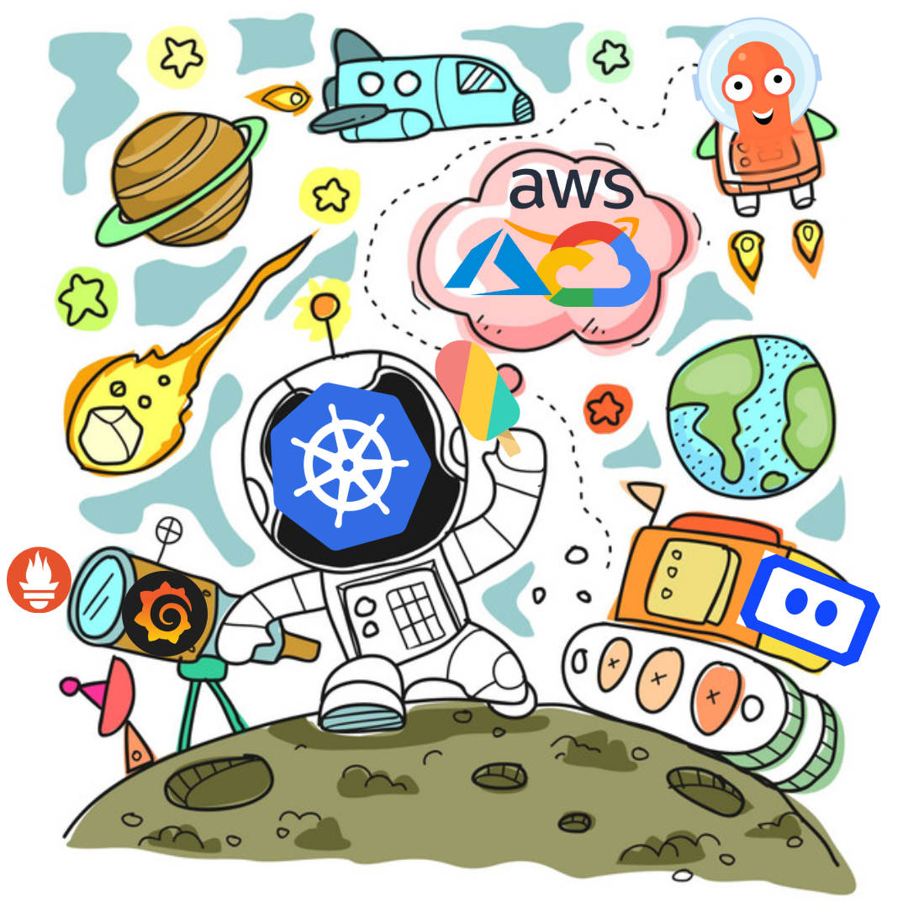
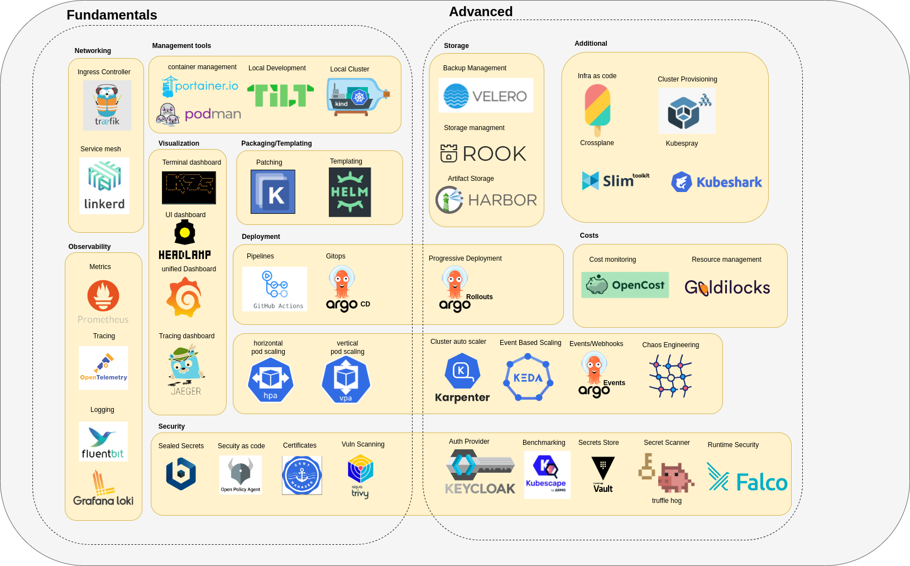

# Apollo11



**Apollo Airlines** — A cloud-native flight management system built across 13
phases, teaching a beginner to build, inspect, break, recover, and explain a
production-shaped Kubernetes platform.

The approved curriculum architecture and the old-to-new migration plan live in
[ROADMAP.md](ROADMAP.md). The stage list below reports the **current repository
state**; target moves are not marked complete until their replacement labs pass
a clean lifecycle verification.



---

## 🛫 The Application: Apollo Airlines

A flight reservation platform with 6 services and 4 infrastructure components:

| Service | Tech | Role |
|---|---|---|
| identity | Python/FastAPI | JWT auth, passenger profiles |
| flight | Go/Gin | Flight inventory, seat management |
| booking | Go/Gin | Reservations (flagship workflow) |
| search | Go/Gin | Flight search |
| notification | Go/Gin | Event fan-out |
| frontend | React (Tailwind CSS) | SPA |

**Infrastructure:** 3 PostgreSQL databases + 1 Redis

Launchpad also runs Dozzle as an optional log viewer. It is tooling around the
ten-component application, not an additional Apollo Airlines workload.

The **flagship workflow** — create a booking — spans 4 services and generates a distributed trace that students observe in observability tools:

```
Frontend → Booking Service → Identity Service
                        → Flight Service (get flight)
                        → Flight Service (decrement seats)
                        → Booking DB
                        → Notification Service
```

---

## Current stage status

Apollo11 is being migrated toward the target roadmap one verified phase at a
time. Launchpad through Stage 7 remain the current runnable spine. Stage 8 is a
clean rebuild, Stage 9 is the AWS/EKS cloud capstone, and Stages 10–11 are
optional mission catalogs.

### 🧱 Launchpad – Docker Compose ✅ [📖 README](stages/launchpad/README.md)

* ☑️ Learn what **Docker** is, why it exists, and how it solves the problem of environment consistency.
* ☑️ Understand containers conceptually and how they differ from virtual machines.
* ☑️ Write **Dockerfiles** and build container images using best practices and layering principles.
* ☑️ Use **Docker Compose** to run and wire together multiple containers locally.
* ☑️ Learn **YAML** syntax and structure as the foundation for Kubernetes configuration files.
* ☑️ Run all six application images as non-root with read-only root filesystems.
* ☑️ Keep local credentials out of Git using `.env` and a committed `.env.example` contract.
* ☑️ Verify all services have `/healthz`, dependency-aware `/readyz`, and Prometheus-compatible `/metrics` endpoints.
* ☑️ Break Flight PostgreSQL and observe readiness propagate through Search and Booking before recovery.
* ☑️ Modern React/Tailwind CSS frontend with environment-based API configuration

---

### 🔥 Ignition – First Kubernetes Cluster ✅ [📖 README](stages/ignition/README.md)

* ☑️ Launch a local Kubernetes cluster using **kind** and understand what components are created.
* ☑️ Use core **kubectl** commands to inspect, apply, modify, and delete Kubernetes resources.
* ☑️ Understand the difference between **imperative and declarative** resource management in Kubernetes.
* ☑️ Get a high-level overview of Kubernetes cluster architecture, with concepts that will be revisited in depth later.
* ☑️ Use a reusable evidence ladder: status → events → describe → logs → endpoint behavior.
* ☑️ Crash a container and prove kubelet recovery through restart count, stable Pod UID, and HTTP behavior.
* ☑️ Delete a bare Pod, observe that it stays absent, then reapply its manifest and prove recovery with a new UID.
* ☑️ Complete a fresh three-node lifecycle with **14/14** automated checks and no retained test-cluster residue.

---

### Stage 1 : 🚀 Liftoff – All Workloads on Kubernetes ✅ [📖 README](stages/stage1/README.md)

* ✅ Organize all ten workloads in one **namespace**.
* ✅ Deploy applications with **Deployments** and observe their ReplicaSets and reconciliation behavior.
* ✅ Give Pods stable endpoints using **Services**.
* ✅ Run one-time database initialization using **Jobs** and mounted ConfigMaps.
* ✅ Externalize configuration using **ConfigMaps** and **Secrets**.
* ✅ Give all 13 workloads dedicated, tokenless **ServiceAccounts** and prove they cannot read Pods.
* ✅ Trigger an invalid-image rollout, diagnose `ImagePullBackOff`, preserve service availability, and roll back.
* ✅ Compare ephemeral `emptyDir` storage with the persistence added in Stage 3.
* ✅ Pass **167/167** behavioral checks and remove all Stage 1 namespace residue.

---

### Stage 2 : 🧭 Guidance, Navigation & Control – Networking ✅ [📖 README](stages/stage2/README.md)

* ✅ Resolve services through Kubernetes **DNS** and inspect cross-namespace routing.
* ✅ Compare ClusterIP, NodePort, and LoadBalancer **Services**.
* ✅ Route external traffic through Traefik **Ingress** and Envoy **Gateway API**.
* ✅ Assign local LoadBalancer addresses with **MetalLB**.
* ✅ Read reference **NetworkPolicies**; enforcement is deliberately deferred until a NetworkPolicy-capable CNI is introduced.

---

### Stage 3 : 💾 Mission Data – Persistent Storage ✅ [📖 README](stages/stage3/README.md)

* ✅ Replace `emptyDir` databases with **StatefulSets** and per-Pod PVCs.
* ✅ Inspect **PersistentVolumes**, claims, StorageClasses, and reclaim behavior.
* ✅ Use headless Services for stable StatefulSet network identity.
* ✅ Bootstrap PostgreSQL schemas through `/docker-entrypoint-initdb.d/` and seed data with idempotent Jobs.
* ✅ Delete a database Pod and prove that its data survives.

---

### Stage 4 : 🎛️ Flight Control Systems ✅ [📖 README](stages/stage4/README.md)

* ✅ Configure distinct **startup**, **liveness**, and **readiness probes**.
* ✅ Define equal CPU/memory requests and limits and observe **Guaranteed QoS**.
* ✅ Drain in-flight requests with graceful SIGTERM handling.
* ✅ Use **PodDisruptionBudgets** to constrain voluntary disruption.
* ✅ Delete workloads and observe termination, replacement, and recovery behavior.

---

### Stage 5 : 📦 Mission Payload Integration – Packaging ✅ [📖 README](stages/stage5/README.md)

* ✅ Package and template the verified platform using **Helm**.
* ✅ Compare Helm with committed **Kustomize** overlays for dev, staging, and prod.
* ✅ Validate and publish images through **GitHub Actions** CI.
* ✅ Reconcile isolated environments through an optional **Argo CD** GitOps module.

---

### Stage 6 : 📡 Mission Operations – Observability ✅ [📖 README](stages/stage6/README.md)

* ✅ Collect and query metrics using **Prometheus**.
* ✅ Visualize metrics and build dashboards using **Grafana**.
* ✅ Centralize logs using **Loki** and correlate them with metrics.
* ✅ Trace requests across services using **OpenTelemetry**.
* ✅ Debug using distributed traces.
* ✅ Use **DaemonSets** to deploy monitoring and system agents on every node.

---

### Stage 7 : 🛰️ Orbital Maneuvering – Scaling ✅ [📖 README](stages/stage7/README.md)

* ✅ Configure a CPU-based **Horizontal Pod Autoscaler (HPA)** and inspect its live metrics and decisions.
* ✅ Generate recommendation-only resource guidance using **Vertical Pod Autoscaler (VPA)**.
* ✅ Add Redis cache-aside behavior with observable HIT/MISS responses.
* ✅ Run a reversible scheduling lab using **PriorityClasses**, a worker taint,
  toleration, node affinity, and topology spread.
    
---

### Stage 8 : 🔐 Command Module Hardening – Security ⚠️ Planned [📖 roadmap](ROADMAP.md)

The target Stage 8 is a clean rebuild from the verified Stage 7 Helm baseline;
the existing Stage 8 tree does not inherit implementation trust.

* ☐ Enforce workload identity, least-privilege **RBAC**, restricted Pod Security
  Admission, and hardened container defaults.
* ☐ Replace kindnet with **Calico** and prove default-deny and least-privilege
  **NetworkPolicy** behavior.
* ☐ Deliver and rotate external secrets using **Vault** and the **External
  Secrets Operator**.
* ☐ Enforce admission and supply-chain policy with **Kyverno**, **Trivy**, and
  **Cosign**.

---

### Stage 9 : 🌕 Lunar Orbit – Cloud Deployment ⚠️ Planned [📖 status](stages/stage9/README.md)

* ☐ Build an incremental **Terraform** lifecycle for AWS networking, **EKS**,
  ECR, storage, identity, and platform add-ons.
* ☐ Deploy the latest hardened Helm snapshot with real DNS and automated TLS.
* ☐ Exercise Pod and node scaling with **Cluster Autoscaler**.
* ☐ Reuse topology and disruption controls during node-failure and drain drills.
* ☐ Perform a controlled Kubernetes upgrade with behavioral pre/post checks.
* ☐ Prove backup and restore with **Velero**.
* ☐ Audit cost, ownership-scoped teardown, and residual resources.
* ☐ Complete an EKS-to-GKE portability analysis; hands-on GKE remains optional.

---

### Stage 10 : 🧪 Mission Extensions ⚠️ Planned [📖 status](stages/stage10/README.md)

This is an optional catalog, not a linear stage that every learner must finish.

* ☐ Implement a **service mesh** using **Linkerd**.
* ☐ Perform progressive delivery using **Argo Rollouts**.
* ☐ Debug with **ephemeral containers** and inspect traffic with **Kubeshark**.
* ☐ Introduce controlled failures using **Chaos Mesh**.
* ☐ Extend the required Velero exercise into advanced disaster recovery.

---

### Stage 11 : 🚀 Towards Mars ⚠️ Planned [📖 status](stages/stage11/README.md)

This is an optional specialization catalog. Each track declares its own
prerequisites and can be completed independently.

* ☐ Design and implement custom **CRDs** and **Kubernetes operators**.
* ☐ Build a **homelab using k3s** and expose services securely.
* ☐ Implement event-driven autoscaling using **KEDA**.
* ☐ Build internal developer platforms using **Backstage**.
* ☐ Analyze and optimize cluster costs using **Kubecost**.
* ☐ Manage clusters declaratively using **Cluster API**.

---

## How to use the labs

Completed stages provide automation because the platform is large and every
snapshot must remain reproducible. Treat `apply.sh` and `verify.sh` as the
installer and answer key. The learning happens in each README's manual
inspection and failure exercises: observe the new behavior, break it safely,
recover it, and only then run the full verifier.

Pass counts show that the repository is internally consistent; they do not
replace being able to explain what Kubernetes did and which evidence proved it.

---

## Prerequisites

- Basic knowledge of Linux (command line, file system, environment variables)
- Docker installed and running (`docker --version`)
- No prior Kubernetes experience required

---

## Getting Started

### 1. Bootstrap the toolchain (mise)

```bash
git clone https://github.com/darshan-raul/Apollo11.git
cd Apollo11
./prep.sh            # installs mise, activates it in your shell, installs every tool in mise.toml
exec $SHELL          # or: source ~/.bashrc / ~/.zshrc
./prep.sh --verify   # every line should be ✅
```

`prep.sh` installs [mise](https://mise.jdx.dev) if needed and installs the tools
into your global mise config, so they stay on `PATH` after you check out the
pinned course commit. Docker is the one tool it does not install (it needs a
daemon): install Docker Engine (Linux) or Docker Desktop (macOS, Windows + WSL2)
first.

### 2. Tools Installed

Defined in [`mise.toml`](./mise.toml):

| Tool | Purpose |
|---|---|
| docker | Container runtime (install yourself; `prep.sh` checks it) |
| kubectl | Kubernetes CLI |
| kind | Local k8s clusters |
| helm | Chart packaging |
| jq | JSON processing in verify scripts |
| kustomize | Config patching |
| argocd | GitOps deployment |
| k6 | Load testing |
| trivy | Image scanning |
| task | Task runner |
| k3d / minikube | Alternative local k8s |

AWS/EKS track only: `mise use -g awscli terraform`.

### 3. Start with Launchpad

```bash
cd stages/launchpad
docker compose up
```

---

## Project Structure

```
Apollo11/
├── SPEC.md                   # Full API contracts, service schemas, endpoints
├── README.md                 # This file
├── ROADMAP.md                # Approved curriculum and migration matrix
├── AGENTS.md                 # Agent context for AI assistants
│
├── stages/
│   ├── launchpad/            # Docker Compose — 10 components, stub code
│   │   ├── README.md
│   │   ├── docker-compose.yml
│   │   └── code/             # identity, flight, booking, search, notification, frontend
│   │
│   ├── ignition/             # kind cluster, first Pod, kubectl basics
│   │   └── README.md
│   │
│   ├── stage1/               # K8s: Deployments, ConfigMaps, Secrets, Jobs
│   │   ├── README.md
│   │   ├── k8s/
│   │   ├── scripts/
│   │   └── code/
│   │
│   ├── stage2–stage11/       # Current snapshots; target scope in ROADMAP.md
│   │
└── test/                     # Automated verification scripts per stage
```

Each large phase keeps one independently runnable snapshot. Under the target
structure, substages use ordered manifests, patches, or scripts instead of
duplicating the full snapshot.

---

## Code Evolution

| Stage | What Changes |
|---|---|
| Launchpad | Stub code with `/healthz`, `/readyz`, `/metrics`, structured logging. Frontend: React/Tailwind CSS with VITE env vars for API URLs. |
| Stage 1–3 | k8s manifest evolution only, code unchanged |
| Stage 4 | Add `/healthz/startup`, `/healthz/live`, `/healthz/ready` handlers + SIGTERM graceful shutdown. Frontend remains the React/Tailwind snapshot served by NGINX. |
| Stage 5 | Packaging only, code unchanged |
| Stage 6 | Full `/metrics` + OTEL SDK integrated |
| Stage 7 | Search gets Redis caching (X-Cache header) |
| Stage 8 | **Planned clean rebuild:** Stage 7 baseline → RBAC/PSA/hardening → Calico policy → Vault/ESO → Kyverno + Trivy/Cosign |
| Stage 9 | **Planned:** AWS/EKS lifecycle with DNS/TLS, scaling, node failure, upgrade, Velero restore, cost, and teardown drills |
| Stage 10 | **Planned optional missions:** service mesh, progressive delivery, debugging, traffic inspection, chaos, advanced DR |
| Stage 11 | **Planned optional specializations:** operator/CRD, KEDA, k3s, Backstage, Kubecost, Cluster API |

---

## Seed Data (Always Present)

**Airports:** BOM, DEL, SIN, DXB, LHR, JFK

**Flights (today + 30 days):** AA101, AA102, AA201, AA202, AA301, AA401

**Users:**
- `admin@apolloairlines.com` / `admin123` (ADMIN)
- `passenger@apolloairlines.com` / `pass123` (PASSENGER)

---

## Tools

| Category | Tools |
|---|---|
| Frontend | React, Tailwind CSS, Vite |
| Backend API | Golang, Python |
| SQL Database | PostgreSQL |
| NoSQL Database | Redis |
| CI | GitHub Actions |
| GitOps | Argo CD |
| Progressive Deployment | Argo Rollouts |
| Secret Delivery | Vault, External Secrets Operator |
| Ingress Controller | Traefik |
| Gateway API | Envoy Gateway, MetalLB |
| Network Policy | Calico |
| Packaging | Helm |
| Patching | Kustomize |
| Logging | Grafana Alloy, Loki |
| Tracing | OpenTelemetry, Tempo |
| Service Mesh | Linkerd |
| Monitoring | Prometheus, Grafana |
| Policy Engine | Kyverno |
| Supply Chain | Trivy, Cosign |
| TLS | cert-manager |
| Backup and Restore | Velero |
| Load Testing | k6 |
| Cloud and Provisioning | AWS, EKS, ECR, Terraform |
| Chaos Engineering | Chaos Mesh |
| Autoscaling | HPA, VPA, Cluster Autoscaler, KEDA |
| Traffic Inspection | Kubeshark |
| Custom Controllers | Kubernetes Operators |
