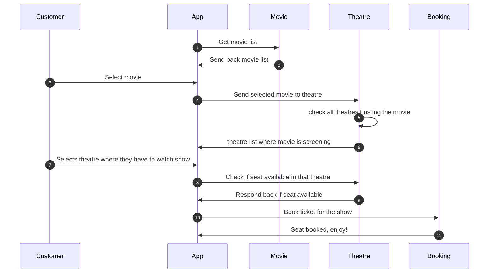

# What will we cover

Here's the architecture of what you will build at the end of this journey

| Category | Tools |
|---|---|
| Backend API |  Golang,Python |
| Sql Database| Postgres |
| Nosql Database | MongoDB | 
| Local Development | skaffold, telepresence/Tilt |
| Container Management | Docker, Podman |
| Cluster Provisioning | Kubespray (optional) |
| Container Builds | Buildah |
| CI | Argo Workflows |
| GitOps | ArgoCD |
| Progressive Deployment | Argo Events, Argo Rollouts |
| Secret Store | Vault |
| Ingress Controller | Apisix |
| Packaging | Helm |
| Patching | Kustomize |
| Logging | Fluentd (agent), Loki (backend) |
| Service Mesh | Istio |
| Monitoring | Prometheus, Grafana |
| Compliance Monitoring | kubebench |
| Policy Engine | OPA/Kyverno |
| Policy Checker | Kubescape |
| Backup and Restore | Velero |
| Load Testing | Kube-monkey |
| Data Analytics | Python |
| Serverless | OpenFaas |

Extra:

- Dapr
- Dagger

## Stages:

- Stage 0: Basics and Local Setup

- Stage 1: Run basic api in local k8s cluster

- Stage 2: Routing using ingress controller

- Stage 3: Move on from Local k8s cluster

- Stage 4: Helm packaging and Kustomize Patching

- Stage 5: Deployment/Gitops

- Stage 6: Monitoring + Observability + Tracing

- Stage 7: Service Mesh

- Stage 8: AutoScaling and Load testing

- Stage 9: Chaos Engineering + Backup and Restore

- Stage 10: Security and Compliance

- Stage 11: Progressive Deployment
